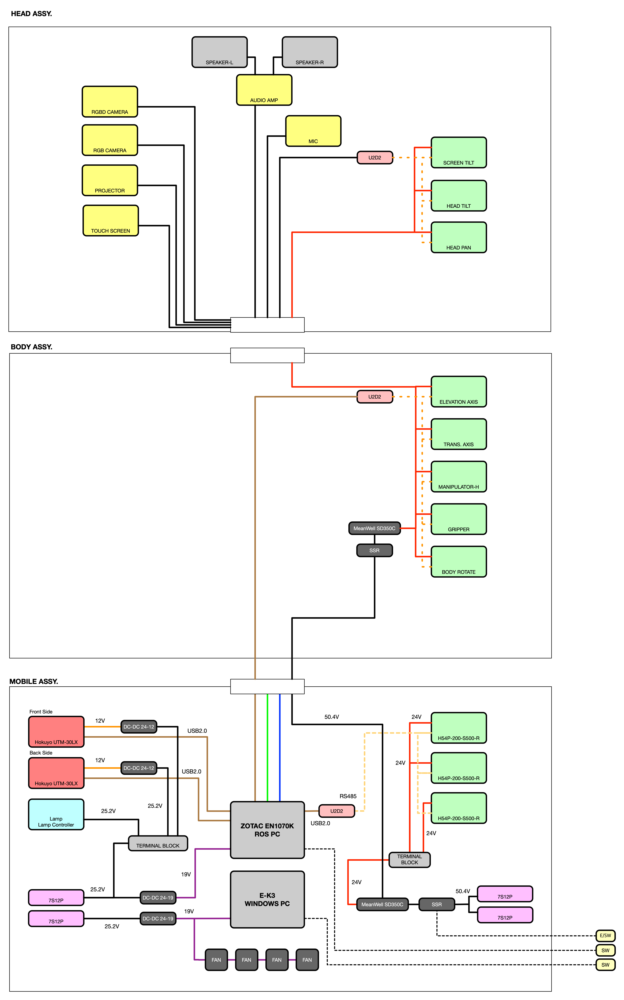

# Electric Connection for ZipSa

## Power

4x Li-Po Battery (7-cells): Output norminal voltage for each battery is 25.9V

- 1x : Ubuntu PC and Screeen, Audio Amp for Speaker in Head Part
- 1x : Windows PC and Projector in Head Part
- 2x : All motors in Robot

## Block Diagram for Electric Connection

### Head Assy

**For 12V**

- Audio Amp
- Motor for Screen Tilt
- Fan
- Touch screen

**For 24V**

- Pan / Tilt motor
- Projector (DC-DC Converter)

### Body Assy

**For 24V**

- 6 DoF Manipulator
- Gripper
- Body rotate motor
- Elevation axis motor
- Arm base motor

### Mobile Assy

**For 12V**

- Front/Rear laser scanner

**For 24V**

- Lamp Controller
- Wheel motors
- PC (Ubuntu/Windows) - DC-DC Converter

## RS485 Connections

3x U2D2 for Dynamixel Motors

- Mobile Base : /dev/ttyUSB0
- Head : /dev/ttyUSB1
- Body + Manipulator + Gripper : /dev/ttyUSB2

